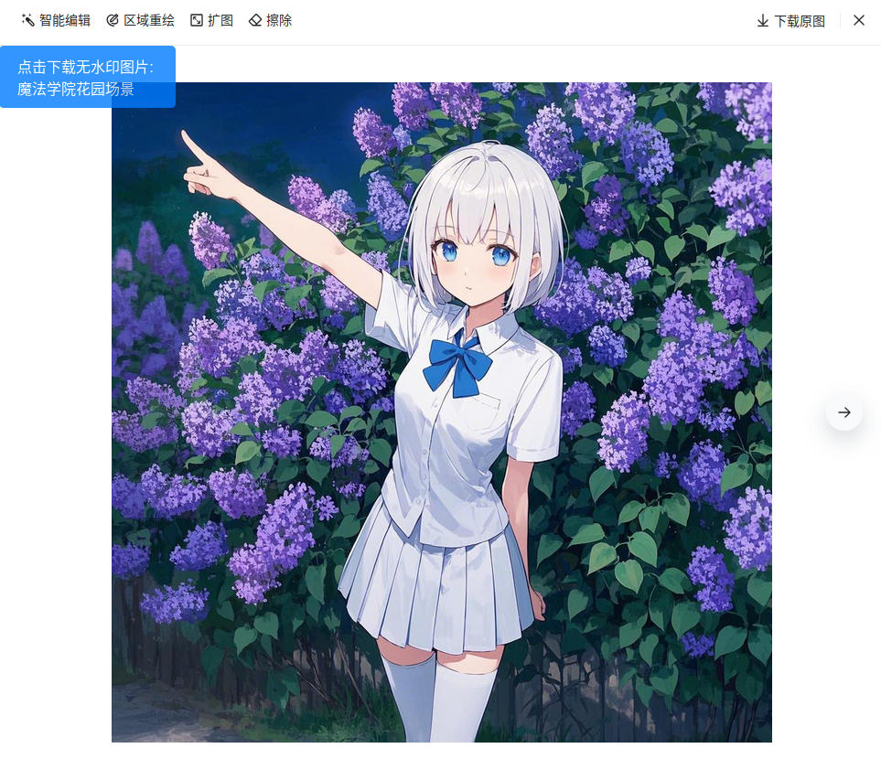

# 从豆包下载无水印图片 Download Origin Image from Doubao without Watermark

这是一个可以让你从 从豆包（www.doubao.com）下载无水印图片 的 userscript 。

**重要提示**：此脚本可能会随着 *豆包（www.doubao.com）* 网站的更新而失效。

## 截图

## 使用说明

### 安装

用户需先安装用户脚本管理器，推荐使用 **油猴 (Tampermonkey)**：

-   [火狐附加组件](https://addons.mozilla.org/zh-CN/firefox/addon/tampermonkey/)
-   [Chrome 应用商店 扩展程序](https://chrome.google.com/webstore/detail/tampermonkey/dhdgffkkebhmkfjojejmpbldmpobfkfo?hl=zh-CN)
-   [Microsoft Edge 外接程序](https://microsoftedge.microsoft.com/addons/detail/tampermonkey/iikmkjmpaadaobahmlepeloendndfphd?hl=zh-CN&gl=CN)

或其他同类扩展程序。用户脚本管理器的安装等相关资料均可参见 [Greasy Fork](https://greasyfork.org/)。

之后安装本用户脚本。脚本安装地址：<https://greasyfork.org/scripts/527890>，点击页面上的 _安装此脚本_ 即可。

### 使用

成功安装后，图片的左上角会新增一个 *下载按钮* 。点击后会下载由 *当前标题+时间为文件名* 的无水印图片。

## 源码

Github：<hhttps://github.com/catscarlet/Download-Origin-Image-from-Doubao-without-Watermark>

## LICENSE

This project is licensed under **GNU AFFERO GENERAL PUBLIC LICENSE Version 3**
