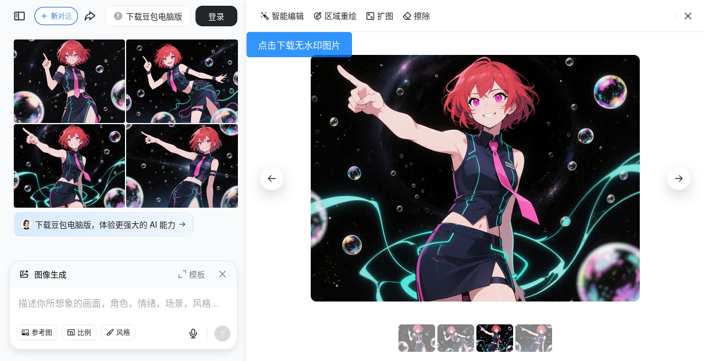

# 从豆包下载 ~无水印~ 图片 Download Origin Image from Doubao ~without Watermark~

**豆包已经封杀了从网站上直接获取无水印图片的方式，此脚本已因为豆包的更新而失效。**

目前网页端给出的图片已自带水印，且其 *下载原图* 功能下载的内容与预览图内容不同。不仅如此，如果使用线上的「视频生成」功能的话，豆包不是用服务器上的无水印原图生成，而是「用你浏览器看到的有水印的缩略图」来生成视频，然后还会再打一次水印上去。参见：<https://www.bilibili.com/video/BV1PG7KznEi4/>

请大家自行找其他方法获取 从豆包下载无水印图片 的方法。

---------
这曾是一个可以让你从 *[豆包（www.doubao.com）](https://www.doubao.com)* 下载无水印图片 的 userscript 。

**重要提示**：此脚本已随着 *[豆包（www.doubao.com）](https://www.doubao.com)* 网站的更新而失效。

## 截图

## 使用说明

### 安装

#### ①安装用户脚本管理器

用户需先安装用户脚本管理器，推荐使用 **[篡改猴/油猴（Tampermonkey）](https://www.tampermonkey.net/)**：

-   [火狐附加组件](https://addons.mozilla.org/zh-CN/firefox/addon/tampermonkey/)
-   [Chrome 应用商店 扩展程序](https://chrome.google.com/webstore/detail/tampermonkey/dhdgffkkebhmkfjojejmpbldmpobfkfo?hl=zh-CN)
-   [Microsoft Edge 外接程序](https://microsoftedge.microsoft.com/addons/detail/tampermonkey/iikmkjmpaadaobahmlepeloendndfphd?hl=zh-CN&gl=CN)

或其他同类扩展程序。用户脚本管理器的安装等相关资料均可参见 [Greasy Fork](https://greasyfork.org/)。

#### ②安装本用户脚本

在完成安装用户脚本管理器后，安装本用户脚本。以下提供两种安装渠道：

- Greasyfork脚本安装地址：<https://greasyfork.org/scripts/527890>，点击页面上的 _安装此脚本_ 即可。
- 如果您访问 greasyfork.org 有困难，可以尝试这个 [GitHub链接](https://raw.githubusercontent.com/catscarlet/Download-Origin-Image-from-Doubao-without-Watermark/refs/heads/main/Download-Origin-Image-from-Doubao-without-Watermark.user.js) 进行安装

### 兼容性

脚本可正确在以下用户脚本管理器中运行

- Tampermonkey: 5.3.3

脚本可正确在以下浏览器中运行。

- Firefox: 137.0.2
- Firefox ESR: 115.22.0esr
- Chrome: 109.0.5414.120

### 使用

成功安装后，图片的左上角会新增一个 *下载按钮* 。点击后会下载由 *当前标题+会话ID+下载时间* 为文件名的无水印图片。

## 源码

Github： <https://github.com/catscarlet/Download-Origin-Image-from-Doubao-without-Watermark>

## LICENSE

This project is licensed under **GNU AFFERO GENERAL PUBLIC LICENSE Version 3**
